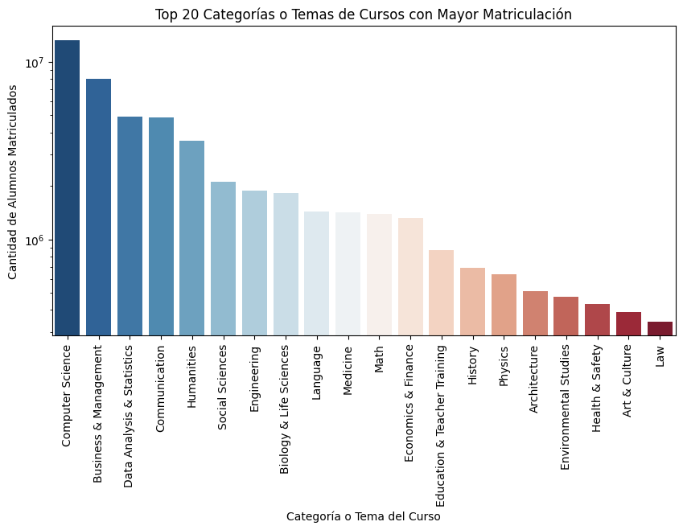
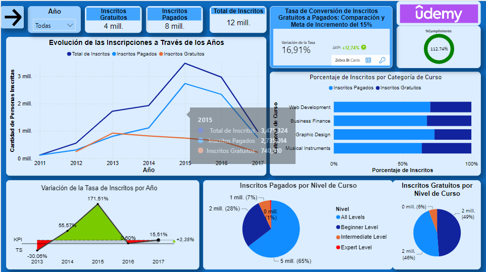

# <h1 align=center> **PROYECTO INDIVIDUAL N°2: Data Analytics** </h1>

# <h1 align="center">**`MOOCs`**</h1>

  
  

*Bienvenid@s a la presentación del segundo proyecto individual de la carrera de Data Science, el cual fue realizado durante la etapa de Labs del bootcamp [Henry](https://www.soyhenry.com/carrera-data-science)*

# **Contexto**

Los MOOCs (Massive Open Online Courses o Cursos en Línea Masivos y Abiertos) representan una herramienta altamente valiosa para el aprendizaje. Estos cursos en línea están cuidadosamente diseñados para llegar a una amplia audiencia de estudiantes a nivel mundial. Ofrecidos por prestigiosas instituciones educativas y expertos en diversas disciplinas, los MOOCs proporcionan acceso gratuito a una amplia gama de materiales didácticos, actividades interactivas y evaluaciones. Un aspecto destacado de los MOOCs es que fomentan el aprendizaje autónomo, permitiendo a los estudiantes progresar a su propio ritmo y adaptar su proceso de aprendizaje a sus necesidades individuales. Además, a través de plataformas educativas en línea, los MOOCs brindan una oportunidad única para participar en comunidades virtuales de aprendizaje, donde los estudiantes pueden interactuar entre sí, intercambiar conocimientos y colaborar en proyectos conjuntos.

# **Objetivo**

El objetivo del proyecto es analizar y sacar conclusiones a partir de los datasets adquiridos de las plataformas Udemy, edX y Coursera. Estos datasets fueron comprados por una startup de tecnología interesada en ingresar al mercado de cursos en línea de manera eficiente. El análisis se centra en segmentar el nivel de ventas según variables como el precio, idioma, nivel y rating de cada curso, con el propósito de determinar la influencia de estas variables en la demanda del producto vendido.

Además, se requiere la creación de un Word Cloud que muestre las palabras clave más frecuentes en los títulos de los cursos, con la posibilidad de añadir otras variables de interés. Como parte del monitoreo de la eficacia de los objetivos de la empresa, se solicita visualizar el KPI (Indicador Clave de Desempeño) establecido en las consignas del proyecto, así como identificar y visualizar otros tres KPIs adicionales derivados del análisis. Estos KPIs se incluirán en el dashboard del proyecto para brindar una visión completa y clara del rendimiento y los resultados obtenidos.

# **Análisis Exploratorio de los Datos (EDA)**

  
  

**Consigna:**

Debe ser funcional y coherente con el storytelling. El dasbhoard tiene que incluir filtros, permitiendo explorar detalladamente los datos con la selección de cada uno de ellos. Es decir, es indispensable que sea interactivo. También, se espera que el diseño que implementen facilite la interpretación de la información y su análisis, siendo importante, para ello, la claridad en la presentación de los datos, aspectos inherentes a la esteticidad, elección coherente de los gráficos según las variables a visualizar, entre otros ítems.

**Resolución de la consigna:**

De acuerdo con las [especificaciones del proyecto](https://github.com/JersonGB22/ProyectoIndividual2_DataAnalytics_Henry/tree/main/Consignas), se realizó el Análisis Exploratorio de Datos (EDA) en el archivo [EDA.ipynb](https://github.com/JersonGB22/ProyectoIndividual2_DataAnalytics_Henry/blob/main/EDA.ipynb). Se utilizaron los datasets de las plataformas de aprendizaje en línea ``Udemy``, `Edx` y `Coursera`. Antes de llevar a cabo el EDA de cada dataset, se realizó una Extracción, Trasformación y Carga de Datos (ETL) utilizando las librerías de Python: Numpy, Pandas, Regex y Stopwords. Durante este proceso, se eliminaron columnas innecesarias, se unieron los datasets de Coursera para formar un único dataset completo creando columnas relevantes, se convirtieron campos de tipo fecha a tipo datetime, se imputaron valores faltantes, se realizó el preprocesamiento de texto para la realización de los Word Clouds y se procesaron algunas columnas categóricas y numéricas relevantes tanto para el EDA como para la creación de los Dashboards. Por último, se exportaron los datasets tratados, listos para ser utilizados en la creación de los dashboards, los cuales se encuentran alojados en la carpeta [Datasets](https://github.com/JersonGB22/ProyectoIndividual2_DataAnalytics_Henry/tree/main/Datasets).

El EDA consistió en análisis univariados, incluyendo la visualización de las principales estadísticas descriptivas de las variables numéricas, boxplots, histogramas y barplots. Además, se realizaron Word Clouds utilizando las variables `title` y ``summary`` de los datasets respectivos. El análisis bivariado del EDA incluyó la generación de heatmaps y barplots entre las variables más importantes y relevantes.

*Por último, se recomienda encarecidamente al lector revisar el notebook donde se encuentra alojado el EDA, ya que contiene explicaciones exhaustivas y comentarios detallados que describen cada paso del proceso realizado.*

# **Realización del Dashboard**

  

**Consigna:**

Debe ser funcional y coherente con el storytelling. El dasbhoard tiene que incluir filtros, permitiendo explorar detalladamente los datos con la selección de cada uno de ellos. Es decir, es indispensable que sea interactivo. También, se espera que el diseño que implementen facilite la interpretación de la información y su análisis, siendo importante, para ello, la claridad en la presentación de los datos, aspectos inherentes a la esteticidad, elección coherente de los gráficos según las variables a visualizar, entre otros ítems.

**Resolución de la consigna:**

El Dashboard se creó utilizando Power BI, una herramienta de análisis y visualización de datos de Microsoft. Se desarrollaron Medidas, Columnas y Tablas específicas para cada KPI, en función de su complejidad. Para cada KPI se generó un informe completo que presenta los gráficos más relevantes, variables destacadas, tarjetas informativas, seguimiento de la evolución del KPI y monitoreo de su cumplimiento. Además, se aprovechó la funcionalidad de los gráficos de Zebra BI y scripts de Python para mejorar la presentación de los informes. El archivo que contiene el Dashboard y su resolución se encuentra denominado como ``Dashboard.pbix``. Por último, como un plus, el Dashboard se publicó en la web mediante `powerbi.com`, lo que permite su acceso al público en general sin requerir contraseña o correo de Microsoft.

``OBSERVACIÓN:`` Si experimenta dificultades al visualizar los gráficos generados con Zebra BI, puesto que algunos no son gratuitos, puede utilizar la opción de cambio a un gráfico gratuito disponible al presionar el botón ubicado en la parte derecha del gráfico denominado `change view`, o en caso contrario, pruebe la versión de prueba gratuita de Zebra BI.

## [Página Web del Dashboard](https://app.powerbi.com/view?r=eyJrIjoiYmFhMjAwMTAtMzQ1Zi00MmYzLWIzYmUtYzYzNGIwZjBjOGU2IiwidCI6IjJiZTM1NDkyLWEzMmEtNDBiNS1hOWY4LWZmMjMxMTBmZDBhYyIsImMiOjR9&pageName=ReportSection)

# **Planteamiento de KPIs**

**Consigna:**

Se deben sugerir 3 KPIs y mostrarse en el dashboard. Téngase presente que deben tener relación con la historia que usted está contando. Asimismo, se espera que en la presentación explique el análisis y la funcionalidad de los KPIs sugeridos.

+ ``KPI propuesto:`` Tasa de conversión de inscritos gratuitos a inscritos pagados, calculado como (Número de inscritos en cursos pagados / Número de inscritos en cursos gratuitos) * 100. El objetivo a futuro propuesto por la empresa es evaluar si en la tendencia se logra incrementar esta tasa en un 15% en comparación con el año anterior. Actualmente, para este cálculo, usted posee la información de Udemy, pero como desafío extra, se le pide buscar datasets complementarios y permitan comparar evaluar este KPI en las distintas plataformas.

**Resolución de la consigna:**

``KPI 2:`` Aumento del 50% en el crecimiento de los ingresos en comparación con el año anterior en la plataforma Udemy.

* **Análisis:** El KPI se basa en el objetivo de lograr un incremento significativo en los ingresos generados por la plataforma Udemy. Los ingresos se calcularán multiplicando la cantidad de inscritos en los cursos por el precio de cada curso. De esta manera se tendrá una visión clara del rendimiento financiero de la plataforma y permitirá tomar decisiones estratégicas para mejorar aún más el crecimiento de los ingresos. Los resultados obtenidos se pueden utilizar para identificar áreas de oportunidad, como la promoción de cursos populares o la implementación de estrategias de marketing efectivas para atraer a más estudiantes.

* **Funcionalidad:** Este KPI se utilizará para evaluar el desempeño financiero de la plataforma Udemy en comparación con el año anterior. El aumento del 50% en el crecimiento de los ingresos indica un objetivo ambicioso y busca impulsar el éxito económico de la plataforma.

``KPI 3:``  Mantener un promedio de inscritos por encima de 50,000 por categoría de curso en la plataforma edX.

* **Análisis:** Este KPI proporcionará información valiosa sobre qué categorías de cursos están atrayendo un mayor número de estudiantes y cuáles pueden requerir mejoras para aumentar su participación. Además, ayudará a identificar oportunidades para promocionar y destacar categorías de cursos con menor participación.

* **Funcionalidad:** Se utilizará para evaluar la atracción y participación de estudiantes en las diferentes categorías de cursos ofrecidos por edX. Mantener un promedio de inscritos por encima de 50,000 por categoría indica un nivel deseado de interés y compromiso por parte de los estudiantes. El promedio de inscritos para cada categoría, se calcula dividiendo la cantidad total de inscritos en esa categoría entre el número de categorías existentes en la plataforma.

``KPI 4:`` Lograr un promedio de calificación por encima de 4.5 por institución o entidad que imparte cursos en la plataforma Coursera.

* **Análisis:** El KPI se basa en el objetivo de mantener altos estándares de calidad en la educación ofrecida por cada institución o entidad en la plataforma Coursera. El promedio de calificación se calcula sumando los puntajes promedio asignados por los estudiantes a cada curso ofrecido por la institución o entidad, y dividiendo esta suma entre el número total de cursos de esta. Proporcionará información valiosa sobre la calidad percibida de los cursos ofrecidos por cada institución o entidad. Identificará qué instituciones o entidades mantienen altos niveles de satisfacción estudiantil y cuáles pueden requerir mejoras para alcanzar o mantener un promedio de calificación por encima de 4.5.

* **Funcionalidad:** Este KPI se utilizará para evaluar la satisfacción y calidad percibida por los estudiantes en relación con los cursos ofrecidos por cada institución o entidad en Coursera. Mantener un promedio de calificación por encima de 4.5 indica un nivel deseado de excelencia y satisfacción general por parte de los estudiantes.

## **Tecnologías utilizadas:**

 
 
 

#### **Librerías de Python:**

# **Datos del Autor:**
## ***Jerson Brayan Gimenes Beltrán - Data Scientist***
### **Linkedin:** https://www.linkedin.com/in/jerson-gimenes-beltran/
### **Correo electrónico:** jerson.gimenesbeltran@gmail.com
